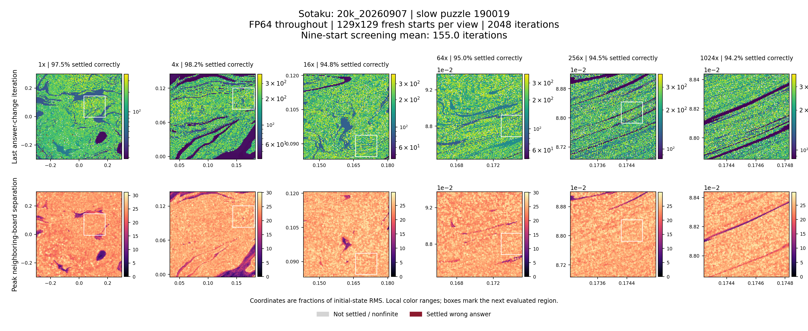
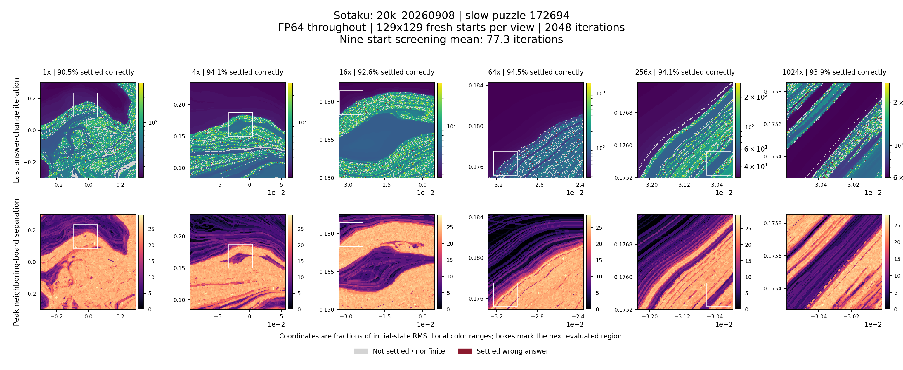

# FP64 Slow-Puzzle Results

Both pipelines completed successfully: 2h44m for seed 20260907 and 2h47m for seed 20260908, on separate H200s. Slow puzzles show curved bands and fine variation through 1024x zoom in FP64, while both easy controls settle correctly at iteration 2 everywhere. The contrast supports examining puzzles that are slow for the model, but these images do not establish fractal self-similarity.

## Screening

Screening took about two minutes per model. Both models used the same 250 puzzles and nine initial states per puzzle, with FP64 encoding and recurrence through iteration 2048.

| Checkpoint | Puzzles Eligible at All Nine Starts | Selected Slow Puzzle | Mean Settling Iteration | Easy Control | Mean Settling Iteration |
|---|---:|---:|---:|---:|---:|
| Healthy 20K, seed 20260907 | 240 / 250 | 190019 | 155.0 | 182525 | 2.0 |
| Late-collapsing 20K, seed 20260908 | 218 / 250 | 172694 | 77.3 | 102875 | 2.0 |

Eligibility requires every start to finish correct and unchanged over the final 128 iterations, with finite arithmetic throughout. The slowest and fastest eligible puzzles were selected by their mean last-answer-change iteration, before viewing any dense maps. Both slow puzzles are in the dataset's 51+ difficulty bucket; both easy controls are in bucket 0. The slow puzzle's individual settling times range from 45 to 252 for the healthy model and 23 to 169 for the late-collapsing model.

The screening arrays and selection checksums match, and an independent local recomputation selects exactly the saved puzzle IDs. There were no nonfinite starts. The healthy checkpoint had 33 wrong final starts and 22 unsettled starts out of 2,250; the late-collapsing checkpoint had 127 and 90. Wrong and unsettled counts overlap. These are repeated perturbations of 250 puzzles, not independent training trials or the full benchmark.

The checkpoint labels come from earlier 4096-iteration FP32 evaluations. This FP64 screening ends at 2048 and selects different puzzles for each model, so the mean settling times above are not a matched comparison of model speed or long-iteration stability.

## Recursive Maps

Each case has six freshly evaluated 129x129 maps, plus an unzoomed 33x33 map in an independently chosen plane. Every start runs 2048 iterations. A successful start finishes correct and unchanged for the final 128 iterations.

| Magnification | Healthy Model, Slow Puzzle: Successful Starts | Settling Iteration Range | Late-Collapsing Model, Slow Puzzle: Successful Starts | Settling Iteration Range |
|---|---:|---:|---:|---:|
| 1x | 97.48% | 19-376 | 90.51% | 22-299 |
| 4x | 98.18% | 41-381 | 94.10% | 24-276 |
| 16x | 94.76% | 45-381 | 92.57% | 28-293 |
| 64x | 94.95% | 49-369 | 94.52% | 29-1542 |
| 256x | 94.54% | 84-377 | 94.06% | 31-277 |
| 1024x | 94.24% | 86-372 | 93.91% | 60-272 |

These percentages describe nearby initial states for one selected puzzle, not benchmark accuracy. Even though all nine screening starts succeeded, the dense maps contain unsuccessful starts. At 1024x, 5.58% of starts in each slow case remain unsettled. No map contains nonfinite trajectories. The second-plane slow controls have 97.15% and 86.69% successful starts, respectively.

Both easy controls have 100% success and last-answer-change iteration 2 across all six maps and the second-plane controls. Their intermediate predictions can differ at the wider views, but the neighboring-board separation is zero from 64x onward in the selected zooms.

### Figures

The top row shows when each prediction last changed; the bottom row shows the largest difference between neighboring predictions during the run. White boxes locate the next evaluated view. Each panel has its own labeled color range.

Easy controls: [seed 20260907](results/20k_20260907/easy/recursive_fp64.png), [seed 20260908](results/20k_20260908/easy/recursive_fp64.png). Second-plane slow controls: [seed 20260907](results/20k_20260907/slow/orientation_control.png), [seed 20260908](results/20k_20260908/slow/orientation_control.png).

## Interpretation and Checks

The healthy model's selected slow puzzle has widespread speckled variation with curved bands. The other model's slow puzzle has broader uniform regions and narrower bands that remain visible at deep zoom. FP64 does not remove this structure. However, visible bands and persistent fine detail are not sufficient to call a map fractal: we have not measured a fractal dimension or demonstrated repeated self-similar geometry. The earlier FP32 illustrations used a different puzzle, so this is not a matched precision-only comparison. FP64 also does not rule out every numerical artifact.

The easy/slow contrast is clear for these four selected cases, not yet a population-wide relationship between difficulty and geometry. Zooms deliberately follow high variation in settling time. The maps describe decoded predictions over a finite run, not convergence of the full hidden state to a fixed point.

Both completion manifests are present on the Volume. Checksums match for 52 downloaded artifacts per model, and all 28 grid summaries match their raw arrays. Raw row chunks remain on the Volume and were not all downloaded. The [protocol](README.md), [preflight](gpu_preflight.json), and [job records](jobs.json) retain the execution details.
