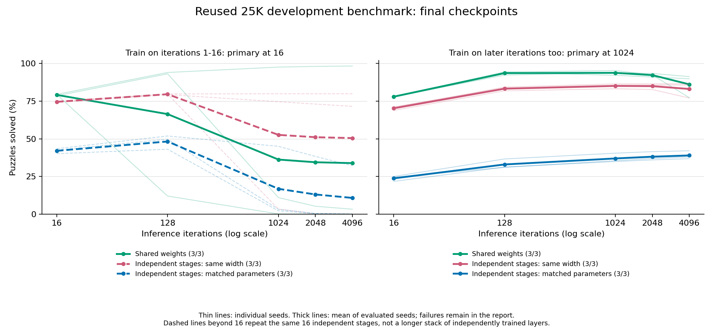
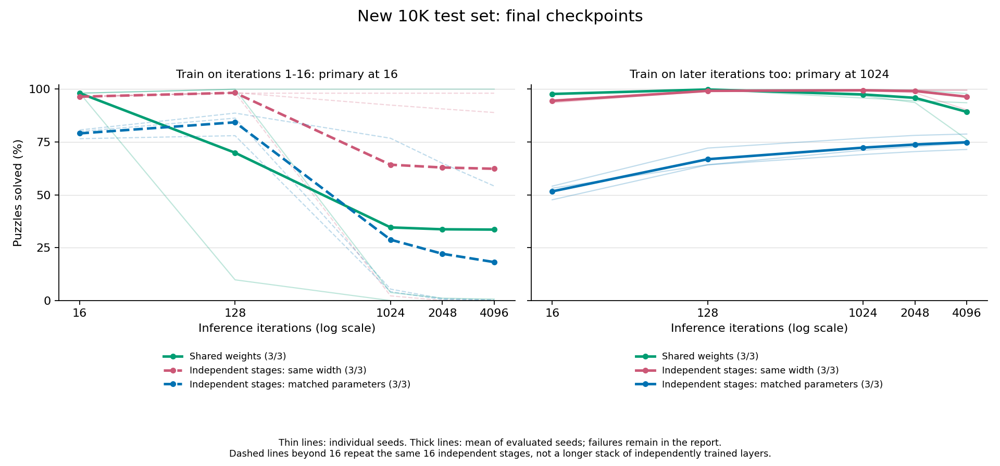
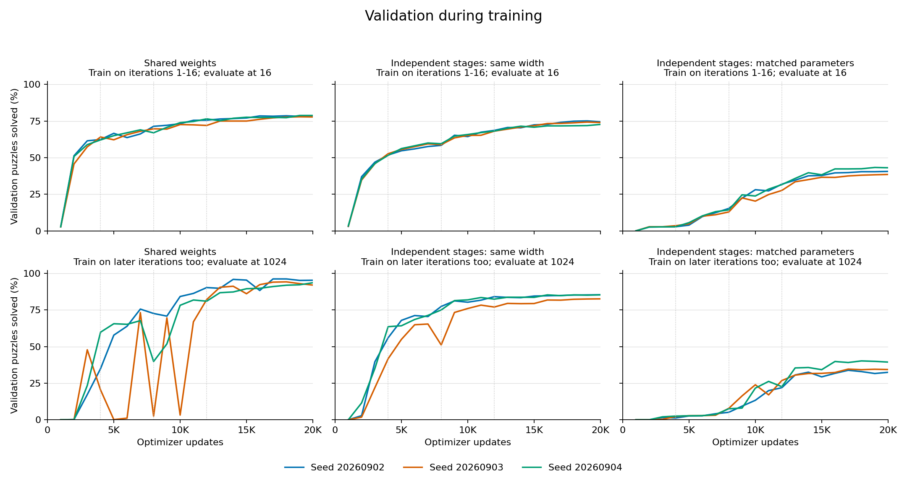

# Weight Sharing: Results

Completed September 3, 2026: 18 fresh training runs and 36 full evaluations. Each run used 20K optimizer updates, not the released model's 50K. The v2 checkpoint and inference defaults are unchanged.

**Sharing weights helped solve harder puzzles under this training recipe. It did not always make correct answers last longer.** The same-width independent stages did worse on sudoku-extreme but often retained correct predictions better on the new, easier puzzles. The parameter-matched independent stages did much worse, though that comparison also makes their hidden state narrower.

## What We Compared

| Model | Transformer weights | Hidden width | Parameters |
|---|---|---:|---:|
| Shared weights | The same four blocks every iteration | 128 | 796,937 |
| Independent stages, same width | Sixteen separately trained four-block stages | 128 | 12,693,257 |
| Independent stages, matched parameters | Sixteen narrower four-block stages | 32 | 797,385 |

The same-width pair started with identical functions: the independent stages were separate copies of the shared blocks. The pair received identical puzzle batches, sampled training iterations, and nominal transformer matmul FLOPs. Actual runtime and optimizer work differ. The input encoder, prediction-feedback projection, and output head remain shared in every model.

For each architecture, three paired seeds trained only on iterations 1-16, and three used the v2 recipe: 80% of batches train iterations 1-16; 20% advance 32/64/128/256/512 iterations without gradients before training the next 16. The loss is ordinary cross-entropy averaged across those 16 supervised iterations. There is no added normalization, auxiliary loss, ES, or inference damping.

An independent 16-stage stack ends at iteration 16. Beyond that, we repeat its stages. Those longer evaluations are repetition diagnostics for the early-trained models. With later-iteration training, the stages already repeat during training. This is not a comparison against thousands of independently trained layers.

All runs use batch size 2048, the same 2.7M-puzzle training pool, dropout 0.1, AdamW, and the existing 20K learning-rate and curriculum schedules. The [protocol](protocol.json) was committed before training. This is a fixed-recipe comparison, not a separate hyperparameter search for each architecture.

## Main Comparisons

These are means across all three seeds using the **final 20K checkpoints**, as specified before evaluation. Accuracy means an entire puzzle is correct. Full evaluations use eager FP32 on H200 with TF32 matmul disabled.

| Training and evaluation | Dataset | Shared weights | Independent, same width | Independent, matched parameters |
|---|---|---:|---:|---:|
| Train 1-16, evaluate at 16 | Reused 25K sudoku-extreme | **79.14%** | 74.53% | 42.03% |
| Train 1-16, evaluate at 16 | New 10K QQWing | **98.09%** | 96.40% | 79.04% |
| Train later iterations too, evaluate at 1024 | Reused 25K sudoku-extreme | **93.77%** | 85.09% | 36.96% |
| Train later iterations too, evaluate at 1024 | New 10K QQWing | 97.45% | **99.41%** | 72.30% |

At iteration 16, shared weights beat the same-width independent stages in all three pairs on both datasets. The sudoku-extreme differences are +4.41, +4.33, and +5.08 percentage points. With later-iteration training and evaluation at 1024, the differences are +8.85, +8.92, and +8.26 points. On the new set at 1024, they are -2.64, -3.50, and +0.26 points.

The new set contains 2,500 puzzles in each QQWing difficulty category. These puzzles are much easier for the trained models than sudoku-extreme; the two sets must not be pooled. The new puzzles and answers were screened against the complete pinned sudoku-extreme train and test splits, including digit relabelings and eight rotations/reflections. This does not cover every row/column permutation symmetry. All checkpoint selections were fixed before any model saw the new set.

## Longer Iterations

Final-checkpoint means for models trained on later iterations:

| Dataset | Model | @128 | @1024 | @2048 | @4096 |
|---|---|---:|---:|---:|---:|
| Reused 25K sudoku-extreme | Shared weights | 93.59% | 93.77% | 92.25% | 86.12% |
| Reused 25K sudoku-extreme | Independent, same width | 83.26% | 85.09% | 84.94% | 83.06% |
| New 10K QQWing | Shared weights | 99.79% | 97.45% | 95.84% | 89.21% |
| New 10K QQWing | Independent, same width | 99.14% | 99.41% | 99.06% | 96.38% |

Saved per-puzzle predictions explain the new-set reversal: between iterations 128 and 1024, the shared models lose an average of 236 previously solved puzzles and gain about one. The independent same-width models lose none and gain about 27. This measures correctness at the two endpoints, not whether predictions changed between them or whether the hidden state converged.

Variation between seeds still matters. The three shared late-trained final models score 95.29/92.13/93.88% at 1024 on sudoku-extreme, then 77.28/89.84/91.26% at 4096. Training on later iterations greatly improves the group over training only the first 16, but does not guarantee deep-iteration stability. One early-trained shared model already reaches 98.30% at 4096, while the other two fall to 0.00% and 3.28%.

The preregistered long-iteration criterion was at least 90% at 1024 with a decline of no more than five percentage points by 4096. On sudoku-extreme, 2/3 shared late-trained final models meet it, versus 1/3 shared early-trained models and 0/3 in each independent-stage group. On the new set, shared late-trained and same-width independent late-trained models both meet it in 2/3 runs. These are observed counts, not precise success probabilities; the criterion is only a repetition diagnostic for early-trained independent stacks.

## Checkpoint Selection And Training

Validation-selected checkpoints are secondary results, not replacements for the final-checkpoint comparison. Selection used the earliest maximum on a fixed 1K sample from the reused benchmark: iteration 16 for early training, or 1024 for later-iteration training. It never used the new set.

Selecting by validation helps the shared late-trained models substantially: their mean sudoku-extreme accuracy becomes 95.03% at 1024 and 92.46% at 4096, versus 93.77% and 86.12% for final weights. All three selected shared late-trained models meet the long-iteration criterion on both sets. On the new set, their selected means are 99.02% and 96.73%, compared with 99.37% and 96.28% for selected same-width independent models. The apparent retention advantage therefore depends on checkpoint selection too.

The shared models' 1024-iteration validation scores still fluctuate earlier in training. From updates 12K-20K, their per-run means are 93.62/90.60/89.23%, with minima 88.30/82.10/81.00%. The same-width independent models are lower but smoother: means 84.57/80.68/84.36%, minima 83.40/77.00/82.40%. The [full report](results/report.md) includes every run, both checkpoint selections, difficulty scores in JSON, and the narrower models.

Average H200 training times, including forward/backward passes, data transfer, optimizer work, and synchronization:

| Training | Shared weights | Independent, same width | Independent, matched parameters |
|---|---:|---:|---:|
| First 16 iterations | 1.06 h | 1.20 h | 0.75 h |
| Later iterations too | 2.04 h | 2.18 h | 1.35 h |

The same-width models have identical nominal transformer matmul FLOPs, but independent stages require more optimizer work. Including preparation, compilation, validation, and checkpoint writes, the 18 training jobs recorded 31.24 GPU-hours in total; full evaluation added 12.21 GPU-hours. These totals exclude queueing, container setup, and separate preflight work. Compilation was unusually slow for two narrow late-trained runs; no worker needed a restart. See [status and verification](STATUS.md) for operational details.

## Conclusion

Weight sharing is doing more than compressing a stored computation here: starting from the same function, the shared and independent weights learn different solvers under the same batches and nominal compute. Shared weights perform better on harder puzzles with this recipe, despite having far fewer parameters. But independent stages can preserve already-correct answers better, particularly for final checkpoints on the easier new set.

Keep the released v2 recipe. This study does not establish that shared weights are universally better, that independently trained models could not catch up with different optimization, or that the 20K ordering persists at 50K. A useful next question is why the independent stages retain answers, but these prediction files alone do not identify a hidden-state mechanism.

## Artifacts

- [Protocol and reproduction commands](README.md), [frozen test puzzles](test_data/README.md), and [data manifest](results/data_manifest.json).
- [All scores and timings](results/report.json), [readable tables](results/report.md), and [training histories](results/learning_curves.json).
- [Pre-evaluation audit](pre_evaluation_audit.json), [checkpoint-selection lock](cohort_lock.json), and [final artifact audit](results/artifact_audit.json).
- [Training jobs](jobs.json) and [evaluation jobs](evaluation_jobs.json). Weights, resumable checkpoints, raw generator output, logs, environment records, and per-puzzle predictions remain on the `sudoku-outputs` Modal volume under `weight_tying_v1_20260902/`; these study checkpoints are not v2 release assets.
